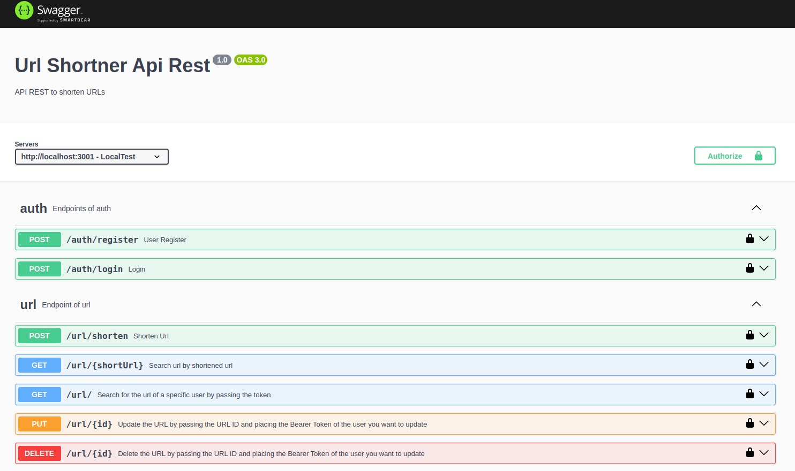
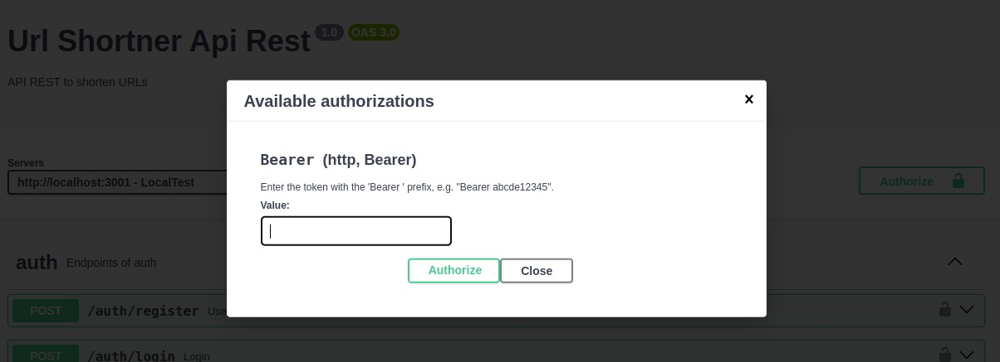

# Encurtador de URLs

## API RESTful para encurtar URLs.

Este projeto foi construido com **NodeJs, JavaScript, Express.js, PostgreSQL e Swagger.**

## Índice

- [Instalação API](#instalação-api)
- [API Endpoints](#api-endpoints)
- [Documentação](#documentação)
- [Insomnia](#insomnia)
- [Sobre](#sobre)

## Instalação API

1. Clonar o repositório:

```bash
git clone https://github.com/thomasgsquinaia/url_shortener.git
```

2. Instalar as dependências: 

```bash
npm install
```

3. Crie um arquivo .env contendo as mesmas variáveis de ambiente presentes no arquivo .env.example, segue o exemplo abaixo:

```markdown
DATABASE_URL=xxxxxxxxxxxxxxxxxxxxxxxxxxxxxxxx
JWT_SECRET=xxxxxxxxxxxxxx
PORT=3001
```

4. Rode o projeto com o comando: 

```bash
npm run dev
```

## API Endpoints
A API fornece os seguintes endpoints:

**AUTH**
```markdown
POST /register - Cria um usuário - {email, password}.
POST /login - Login - {email, password}.
```

**URL**
```markdown
POST /url/shorten - Encurta URL - {originalUrl, BearerToken}.
GET /url/:shortenUrl - Retorna URL por URL abreviado - {shortenUrl}.
GET /url - Retonar as URLs de um usuário específico passando o token - { BearerToken }.
PUT /url/:id - Atualiza uma URL específica - {id, originalUrl, BearerToken}.
DELETE /url/:id - Deleta uma URL específica - {id, BearerToken}.
```

## Documentação

### Caso deseje entre nesse link para acessar a documentação: 

```markdown
https://url-shortener-iaaz.onrender.com/docs
```

<p align="center">
    
</p>

Após fazer o login com a rota /auth/login você deve pegar o token e colocar no campo Value para se autenticar.

<p align="center">
    
</p>

## Insomnia

Se você optar por fazer as solicitações usando o Insomnia, pode importar todas as coleções de solicitações a partir do arquivo `shorten-url.json` localizado na raiz do projeto. 

## Sobre

Linkedin: https://www.linkedin.com/in/thomas-quinaia-82b5221b1/